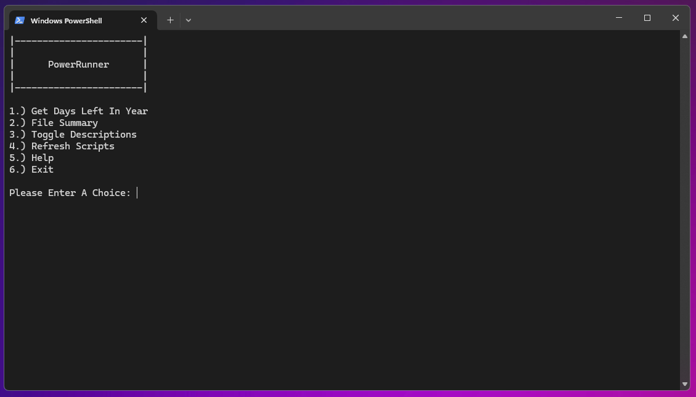
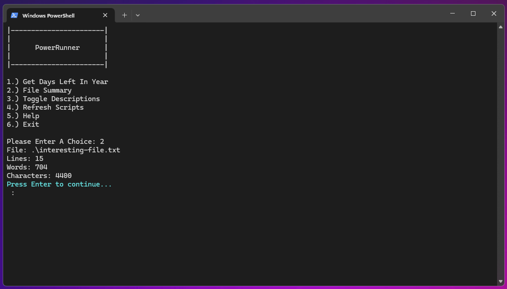

# PowerRunner Script Management System

## Summary
PowerRunner provides a dynamic menu system for executing PowerShell scripts within a specified directory and its subdirectories. It's designed for ease of use, allowing users to add, execute, and manage PowerShell scripts through a simple numbered menu system. This tool is useful for organizing and running scripts for various automation tasks, testing, or administrative purposes without directly consuming resources from the local machine.

## PreRequisites
- PowerShell 5.1 or higher is required.
- Scripts intended for use with PowerRunner should be located in the script's directory or its subdirectories.
- Each script must include specific comments at the beginning to be properly listed in the PowerRunner menu: `DisplayText`, `Description`, and `ConfiguredParameters`.

## Contents
The PowerRunner system includes the main `PowerRunner-Menu.ps1` script, which scans for PowerShell `.ps1` files in its directory and subdirectories, displaying them in a dynamic menu for execution. It supports:
- Dynamically numbered menu entries for found scripts.
- Description toggle for scripts.
- Refresh functionality to update the script list based on the directory contents.
- Help section detailing script formatting requirements.

### Example Scripts
- `ShowDateAndDaysLeft.ps1` - Displays the current date and the number of days left in the current year.
- `FileSummary.ps1` - Provides a summary of lines, words, and characters in a specified file.

## How-To
### Installing PowerRunner
Place `PowerRunner-Menu.ps1` in a directory where you intend to run or manage your PowerShell scripts.

### Adding New Scripts/Folders
Simply add `.ps1` files in the PowerRunner directory or any of its subdirectories. Ensure the scripts include the required comments for `DisplayText`, `Description`, and `ConfiguredParameters` at the beginning.

### Running PowerRunner
- Open a PowerShell prompt and navigate to the directory containing `PowerRunner-Menu.ps1`.
- Execute `.\PowerRunner-Menu.ps1`.
- Use the numbered menu to select a script to run, toggle descriptions, refresh the script list, view help information, or exit.

### Script Formatting
To ensure a script is properly listed in PowerRunner's menu, format the first three lines of your `.ps1` file as follows:
```plaintext
# DisplayText: "Your Script Name"
# Description: "A brief description of what your script does."
# ConfiguredParameters: "Any required parameters, formatted as a single string."

### Refreshing Script List
Select the 'Refresh Scripts' option from the menu to update the list based on the current directory contents.

## Understanding the `ConfiguredParameters`
The `ConfiguredParameters` comment allows you to specify parameters that PowerRunner will pass when executing the script. This is useful for scripts that require input values, such as file paths or configuration options. Format this comment with the exact string you'd intend to pass to the PowerShell script directly.

## Setting the Working Directory
To ensure scripts run with the correct relative path context, You can set the working directory to the location of each script with in your custom scripts themselves. This is particularly useful for scripts that interact with other files or scripts in the same directory. For example, if a script accesses a file named `interesting-file.txt` located in the same directory, it can simply refer to it as `.\interesting-file.txt`. This behavior is achieved with the following line at the beginning of each script:

```powershell
Set-Location -Path $PSScriptRoot
```

## Screenshots
### Main Menu Example



### Descriptions enabled:


### Running A Script
